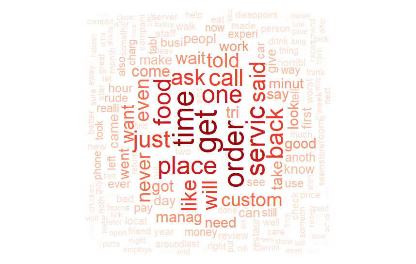

 Access this website through: <b> https://goo.gl/2PyidP </b> to follow along with the presentation

The authors of the following preliminary tests on the Yelp! Database are Mateus Parreiras Silveira and Wender Xavier.

## Introduction

We're in the data era! Enormous amounts of data are being collected and stored by a wide range of applications and many of these are human-generated data which contains information regarding human behavior. The amount of generated data creates a challenge on processing and obtaining valuable information to enhance services and products. Companies trying to improve its services often make part of its stored data available, so users from all over the world can access and propose improvement of services as well as point out hidden patterns on the data. This work present some initial analisys on the Yelp! Dataset. Yelp! is a company which provides local search of business, business ratings and reviews and online food delivery. It works with crowdsourcing model where users goes to business and publish their review of it.

## Related Works
There are many works that use the Yelp! dataset. Here we will discuss some of then.

- _Inferring Future Business Attention_ from Bryan Hood, Victor Hwang and Jennifer King discussed the use of regression models and sentiment analysis to infer the future business attention.

- _Hidden Factors and Hidden Topics: Understanding Rating Dimensions with Review Text_ by Julian McAuley and Jure Leskovec use latent factor model for predicting ratings with LDA for topic modeling to retrive topics and those were found to correspond to genres or categories

- _Centrality and Cluster Analysis of Yelp Mutual Customer Business Graph_ by Brian McClanahan and Swapna S. Gokhale does a study of centrality and clustering in a customer graph shared between business.

- _Improving business rating predictions using graph based features_ from Amit Tiroshi, Shlomo Berkovsky, Mohamed Ali Kaafar, David Vallet, Terence Chen and Tsvi Kuflik use graph to represent the data in order to generate and automatically populate features, with that was discovered that have more accurate and robust predictions

- _Oversampling with Bigram Multinomial Naive Bayes to Predict Yelp Review Star Classes_ by Kevin Hung and Henry Qiu created an analysis of the Yelp! Dataset from 2014 and use Oversampling with Bigram Multinomial Naive Bayes to Predict Yelp Review Star Classes

## Yelp Database

In 2014 Yelp started the _Yelp Dataset Challenge_, they provided a dataset in SQL and JSON containing a subset of their businesses, reviews, and user. The challenge is to encourage students to research and analyse the data. Now the challenge is on round 10 with updated data of 2017 with:
- 4,700,000 reviews
- 156,000 businesses
- 200.000 pictures
- 12 metropolitan areas from 4 countries
- 1,000,000 tips by 1,100,000 users
- Over 1.2 million business attributes like hours, parking, availability, and ambience
- Aggregated check-ins over time for each of the 156,000 businesses

### Database Analysis
The Yelp! dataset contains reviews of many cities and metropolitan areas. In order to get a sample containing most reviews, users and busines of a city, we performed the following analisys on the dataset.

<iframe width="700" height="400" frameborder="0" scrolling="no" src="//plot.ly/~wenderxavier/58.embed"></iframe>

<iframe width="700" height="400" frameborder="0" scrolling="no" src="//plot.ly/~wenderxavier/60.embed"></iframe>
_Comentário Wender: Tips são utilizados na base do Yelp! como dicas em relação à algum estabelecimento, ex: "Restaurante cheio durante o horário de almoço / Estacionamento Privativo pago", enquanto Reviews se referem à experiência do usuário no estabelecimento_

<iframe width="700" height="400" frameborder="0" scrolling="no" src="//plot.ly/~wenderxavier/62.embed"></iframe>

<iframe width="700" height="400" frameborder="0" scrolling="no" src="//plot.ly/~wenderxavier/64.embed"></iframe>

<iframe width="700" height="600" frameborder="0" scrolling="no" src="//plot.ly/~wenderxavier/66.embed"></iframe>

<iframe width="700" height="400" frameborder="0" scrolling="no" src="//plot.ly/~wenderxavier/68.embed"></iframe>

<iframe width="700" height="400" frameborder="0" scrolling="no" src="//plot.ly/~wenderxavier/70.embed"></iframe>

<iframe width="700" height="400" frameborder="0" scrolling="no" src="//plot.ly/~wenderxavier/74.embed"></iframe>

<iframe width="700" height="500" frameborder="0" scrolling="no" src="//plot.ly/~wenderxavier/72.embed"></iframe>

<iframe width="700" height="400" frameborder="0" scrolling="no" src="//plot.ly/~wenderxavier/80.embed"></iframe>

## Graphs

Graph of where each node is a user with more then 3 reviews and the edges are if they reviewed the same business from Phoenix city. 

Having trouble with Pages? Check out our [documentation](https://help.github.com/categories/github-pages-basics/) or [contact support](https://github.com/contact) and we’ll help you sort it out.
