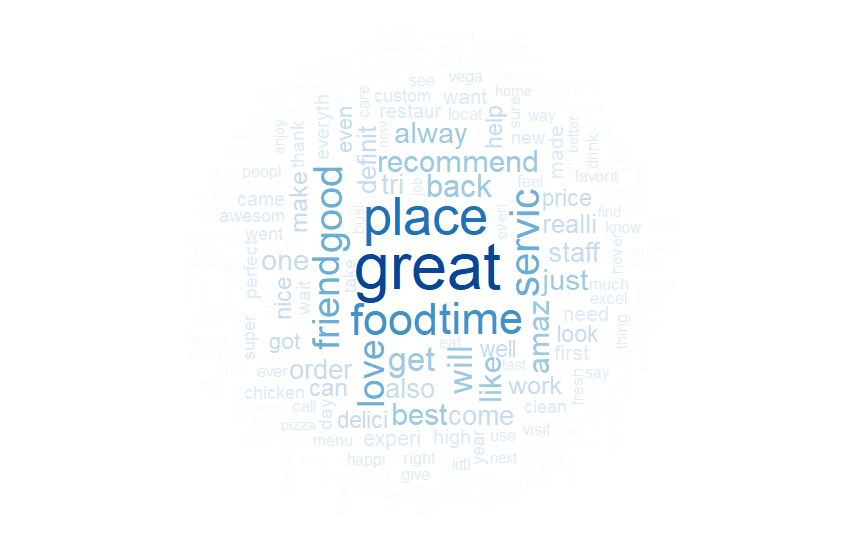
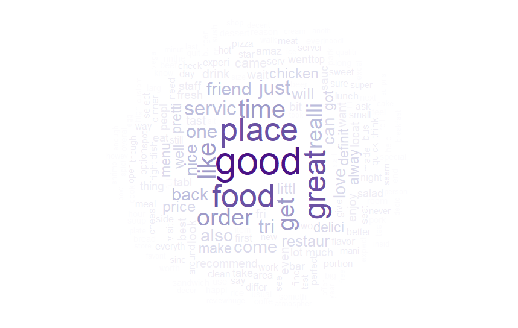
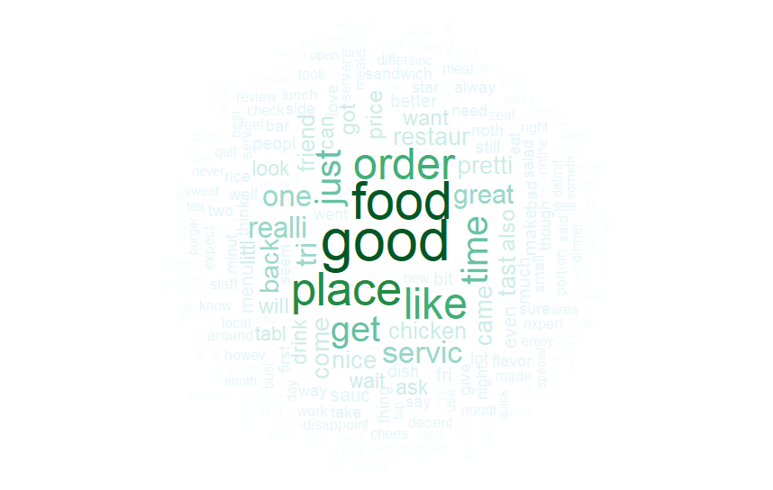
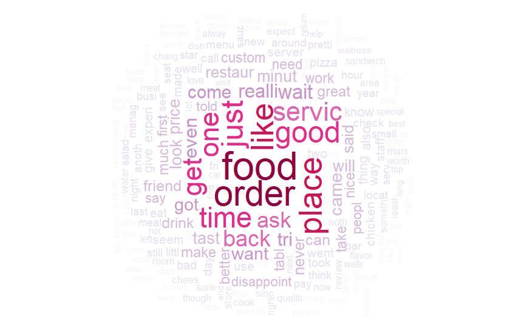

 Access this website through: <b> https://goo.gl/2PyidP </b> to follow along with the presentation

The authors of the following preliminary tests on the Yelp! Database are Mateus Parreiras Silveira and Wender Xavier.

## Introduction

We're in the data era! Enormous amounts of data are being collected and stored by a wide range of applications and many of these are human-generated data which contains information regarding human behavior. The amount of generated data creates a challenge on processing and obtaining valuable information to enhance services and products. Companies trying to improve its services often make part of its stored data available, so users from all over the world can access and propose improvement of services as well as point out hidden patterns on the data. This work present some initial analisys on the Yelp! Dataset. Yelp! is a company which provides local search of business, business ratings and reviews and online food delivery. It works with crowdsourcing model where users goes to business and publish their review of it.

## Related Works
There are many works that use the Yelp! dataset. Here we will discuss some of then.

- _Inferring Future Business Attention_ from Bryan Hood, Victor Hwang and Jennifer King discussed the use of regression models and sentiment analysis to infer the future business attention.

- _Hidden Factors and Hidden Topics: Understanding Rating Dimensions with Review Text_ by Julian McAuley and Jure Leskovec use latent factor model for predicting ratings with LDA for topic modeling to retrive topics and those were found to correspond to genres or categories

- _Centrality and Cluster Analysis of Yelp Mutual Customer Business Graph_ by Brian McClanahan and Swapna S. Gokhale does a study of centrality and clustering in a customer graph shared between business.

- _Improving business rating predictions using graph based features_ from Amit Tiroshi, Shlomo Berkovsky, Mohamed Ali Kaafar, David Vallet, Terence Chen and Tsvi Kuflik use graph to represent the data in order to generate and automatically populate features, with that was discovered that have more accurate and robust predictions

- _Oversampling with Bigram Multinomial Naive Bayes to Predict Yelp Review Star Classes_ by Kevin Hung and Henry Qiu created an analysis of the Yelp! Dataset from 2014 and use Oversampling with Bigram Multinomial Naive Bayes to Predict Yelp Review Star Classes

## Yelp Database

In 2014 Yelp started the _Yelp Dataset Challenge_, they provided a dataset in SQL and JSON containing a subset of their businesses, reviews, and user. The challenge is to encourage students to research and analyse the data. Now the challenge is on round 10 with updated data of 2017 with:
- 4,700,000 reviews
- 156,000 businesses
- 200.000 pictures
- 12 metropolitan areas from 4 countries
- 1,000,000 tips by 1,100,000 users
- Over 1.2 million business attributes like hours, parking, availability, and ambience
- Aggregated check-ins over time for each of the 156,000 businesses

### Database Analysis
The Yelp! dataset contains reviews of many cities and metropolitan areas. In order to get a sample containing most reviews, users and busines of a city, we performed the following analisys on the dataset.

<iframe width="700" height="400" frameborder="0" scrolling="no" src="//plot.ly/~wenderxavier/58.embed"></iframe>

<iframe width="700" height="400" frameborder="0" scrolling="no" src="//plot.ly/~wenderxavier/60.embed"></iframe>

_Comentário Wender: Tips são utilizados na base do Yelp! como dicas em relação à algum estabelecimento, ex: "Restaurante cheio durante o horário de almoço / Estacionamento Privativo pago", enquanto Reviews se referem à experiência do usuário no estabelecimento_

<iframe width="700" height="400" frameborder="0" scrolling="no" src="//plot.ly/~wenderxavier/62.embed"></iframe>

_Comentário Wender: A base de dados do Yelp! contém informações de Check-in, porém somente o valor agregado do número de pessoas que visitaram o local. Considerando que todas as pessoas que postaram um Review ou Tip estiveram no estabelecimento, utilizamos essa informação para saber o número de usuários na cidade_

<iframe width="700" height="500" frameborder="0" scrolling="no" src="//plot.ly/~wenderxavier/72.embed"></iframe>

_Comentário Wender: Considerando as análises acima, nossas futuras análises serão aplicadas utilizando informações das cidades de Las Vegas (EUA), Phoenix (EUA) e Toronto (CAN) pois contém maior número de informações de estabelecimentos e usuários._

<iframe width="700" height="400" frameborder="0" scrolling="no" src="//plot.ly/~wenderxavier/64.embed"></iframe>

_Comentário Wender: Caso um usuário tenha postado um Review/Tip sobre mais de um restaurante podemos considerar essa informação como movimento. Grande parte dos usuários (53%) postaram somente um Review, o que poderia dificultar esta análise. Além disto, a maior parte dos usuários postam somente um Review de cada restaurante que vão, e mesmo voltando ao restaurante futuramente não têm o hábito de postar novos Reviews. Foi verificado que alguns usuários postaram Review sobre restaurantes de diferentes cidades e países. O usuário com maior número de Reviews postados postou pouco mais de 350 Reviews._

<iframe width="700" height="600" frameborder="0" scrolling="no" src="//plot.ly/~wenderxavier/66.embed"></iframe>

_Comentário Wender: Os comentários dos usuários recebem estrelas que variam entre 1 e 5. Nos ultimos anos pode-se ver uma tendência dos usuários postarem somente 5,4 ou 1 estrela para o estabelecimento. O número de reviews postados, principalmente o de 5 estrelas, segue uma tendência bem definida. Nos meses de Nov-Dez há uma diminuição do número de Reviews com nota 5, seguido de um aumento no mês de Jan, uma pequena diminuição em Fev, e em seguida alcançando o pico em Jul-Ago. Tal informação pode estar associado à eventos ou períodos de férias. Estes padrões serão investigadas futuramente._

<iframe width="700" height="400" frameborder="0" scrolling="no" src="//plot.ly/~wenderxavier/68.embed"></iframe>

_Comentário Wender: Uma vez que um usuário posta um Review, outros usuários podem marcá-lo como Useful e Funny. Visualizando a distribuição dos posts, percebe-se que os Reviews com o maior número marcados como Useful possuem 1-2 estrelas (Vide grafo abaixo). Análises aprofundadas neste reviews podem apresentar padrões ou características que fazem com que elas possuem um alto número de aceitação do público, e que possam ser replicadas em outros comentários para também ter esse alto número de marcações de útil._

<iframe width="700" height="400" frameborder="0" scrolling="no" src="//plot.ly/~wenderxavier/70.embed"></iframe>

<iframe width="700" height="400" frameborder="0" scrolling="no" src="//plot.ly/~wenderxavier/80.embed"></iframe>

_Comentário Wender: Padrões de comportamento humano alteram-se durante alguns eventos de larga escala (e.g. Jogos de Futebol, Shows, etc.) Um grande espetáculo que ocorre todos os anos é o Super Bowl, a final do campeonato de futebol americano nos EUA. Todos os anos esse evento tem o maior número de espectadores no planeta, e vários bares e restaurantes nos EUA transmitem o jogo para atrair fãs consumidores. Em uma pesquisa rápida na base de dados, verificamos que alguns comentários (+1000) possuiam palavras chaves que remetiam ao jogo (ex: 'Super Bowl'). Uma vez que usuários podem ter postado reviews em dias seguintes ao jogo e não necessariamente no dia do ocorrido, agregamos informações de Dom-Qui sento Domingo o dia do Super Bowl, e Seg-Qui dias em que os usuários podem ter postado reviews. Uma das perguntas a serem respondidas é: Como os padrões de visitação e comentários se alteram em relação à semanas rotineiras e em eventos/feriados (e.g: Thanksgivin e Super Bowl)?

Abaixo apresentamos um Word-Cloud da semana do NFL/2017 dos Reviews de acordo com o número de estrelas dadas._

## Graphs

Graph of where each node is a user with more then 3 reviews and the edges are if they reviewed the same business from Phoenix city. 

